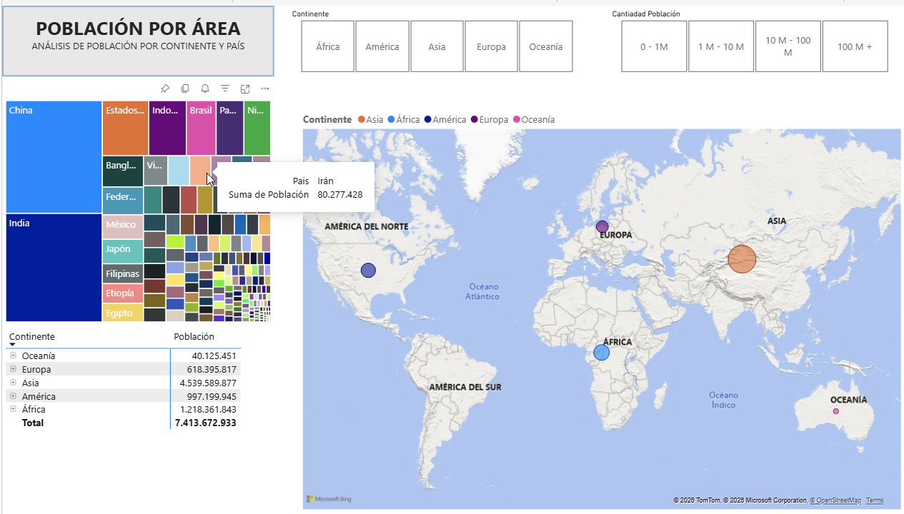
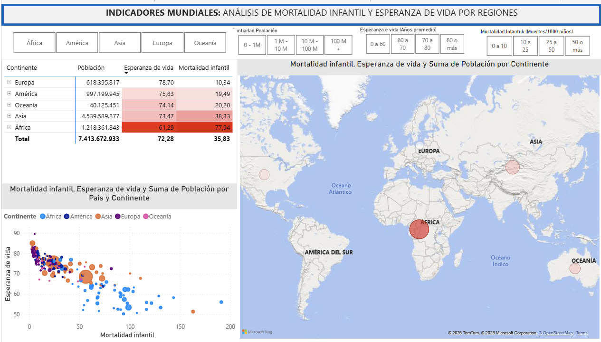

🌍 Global Population & Health Analytics Dashboard

Interactive global analytics dashboard developed with Microsoft Power BI to explore population distribution, life expectancy, and infant mortality across countries and continents.

## 🔗 Live Dashboard

👉 [View Interactive Dashboard in Power BI](https://app.powerbi.com/view?r=eyJrIjoiODBiZjFjZWMtNmViYy00MjM3LWI4MTYtYTYwYjJhNGZiYzE3IiwidCI6ImU1MTU4NTE4LTE1MGItNDMzZS05NjlhLTg0MTg5ODU0MjIyMyJ9)

👉 View Interactive Dashboard in Power BI

📌 Project Overview

The goal of this project is to analyze global demographic and health indicators through an interactive and easy-to-understand Power BI dashboard.

The report provides insights into population distribution, life expectancy, and infant mortality across different countries and continents, allowing users to explore geographic patterns and compare key indicators between regions.

The dashboard includes multiple report pages focused on both global population analysis and the relationship between health and demographic indicators.

This project was created as part of my continued learning and practice in Data Analysis and Business Intelligence.

📊 Dashboard Features

* 🌍 Global population analysis by continent and country
* 👥 Population distribution across geographic regions
* ❤️ Average life expectancy by continent and country
* 👶 Infant mortality analysis
* 🗺️ Interactive geographic visualization of global indicators
* 📈 Analysis of the relationship between infant mortality and life expectancy
* 📊 Comparison of demographic and health indicators by continent
* 🔎 Interactive filtering by continent and population range
* 🎯 Filtering by life expectancy and infant mortality ranges
* 🌳 Treemap visualization of population distribution by country

📑 Report Pages

🌍 Population by Area

Provides an overview of the world’s population distribution by continent and country.

Users can explore population differences using geographic maps, treemaps, tables, and interactive filters.

❤️ Global Indicators

Analyzes the relationship between population, life expectancy, and infant mortality.

The page combines geographic visualization with a scatter plot to identify patterns between health indicators across countries and continents.

🛠️ Technologies

* Microsoft Power BI
* Power Query
* DAX
* Data Modeling
* Data Visualization
* Interactive Data Filtering
* Geographic Data Visualization

📂 Project Structure

Global-Population-Health-Analytics/
│
├── Global_Population_Health_Analytics.pbix
├── README.md
│
├── data/
│   └── Countries.xlsx
    └── Infant+death+rate.xlsx
    └── Life+exepctancy.xlsx
    └── Paises.xlsx
    └── Population.xlsx
│
└── images/
    ├── population-dashboard.png
    └── health-indicators-dashboard.png