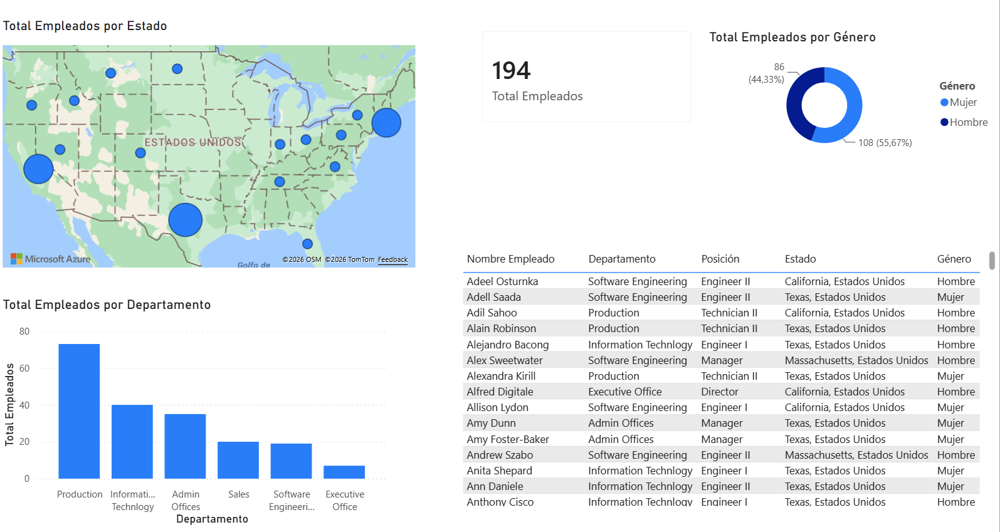

# 📊 Employee Analytics Dashboard

Interactive employee analytics dashboard developed with **Microsoft Power BI** to visualize and analyze workforce data across different departments, locations, and demographic groups.



## 🔗 Live Dashboard

👉 [View Interactive Dashboard in Power BI](https://app.powerbi.com/view?r=eyJrIjoiOGZmODk1OTItODY2YS00NDIxLTk4MDAtNzc1ZWZlY2VkOWI0IiwidCI6ImU1MTU4NTE4LTE1MGItNDMzZS05NjlhLTg0MTg5ODU0MjIyMyJ9)

## 📌 Project Overview

The goal of this project is to transform employee data into an interactive and easy-to-understand dashboard using **Power BI**.

The report provides an overview of the workforce and allows users to analyze employee distribution by **department, gender, and geographic location**.

This project was created as part of my continued learning and practice in **Data Analysis and Business Intelligence**.

## 📊 Dashboard Features

- 👥 Total number of employees
- 🏢 Employees by department
- ⚧ Employee distribution by gender
- 🗺️ Geographic distribution of employees across the United States
- 📋 Detailed employee information
- 🔎 Interactive filtering and data exploration

## 🛠️ Technologies

- Microsoft Power BI
- Power Query
- DAX
- Data Modeling
- Data Visualization

## 📂 Project Structure

```text
PowerBI-Employee-Analytics/
│
├── Employee_Analytics.pbix
├── README.md
│
├── data/
│   └── employee_data.xlsx
│
└── images/
    └── dashboard.png
