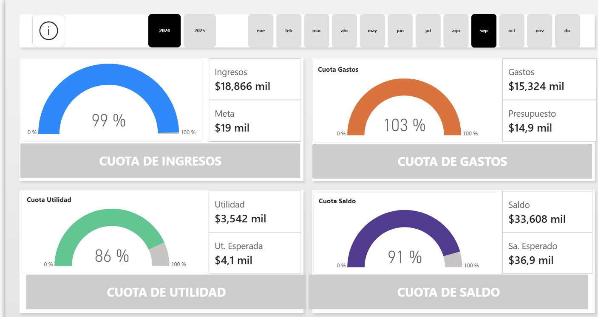
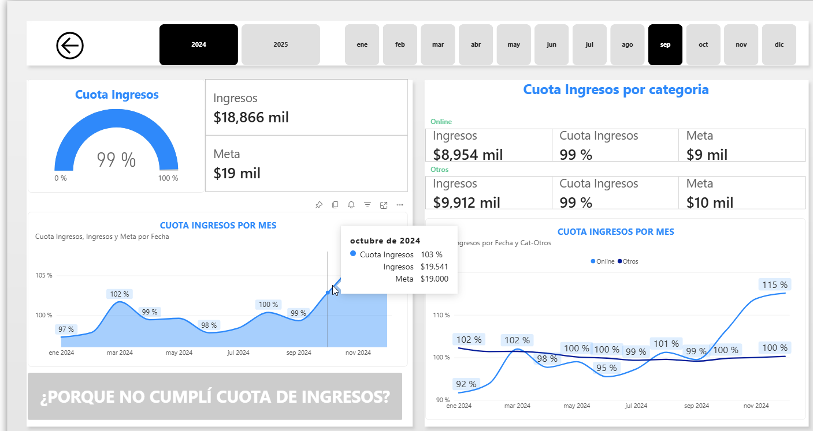
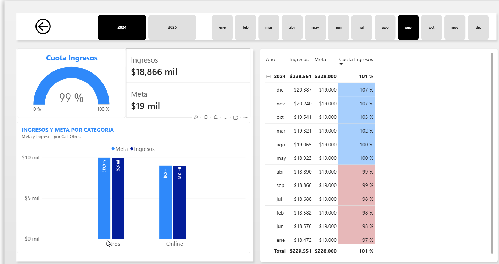
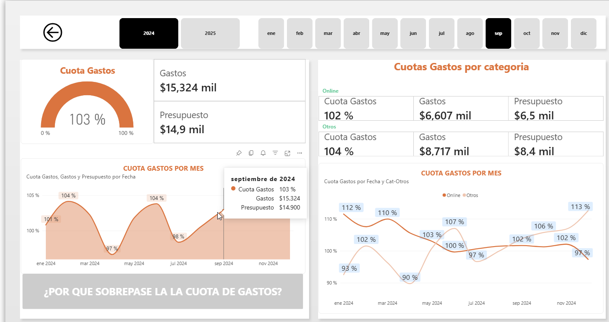
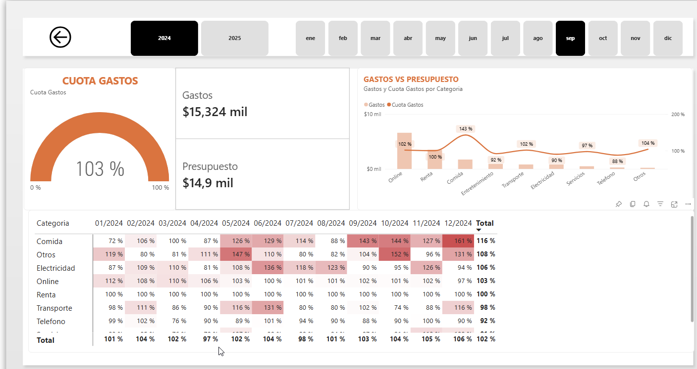
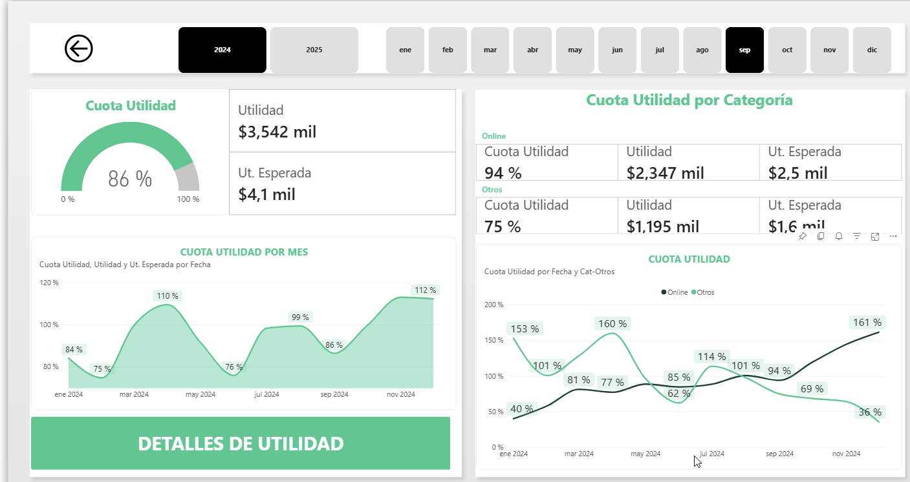
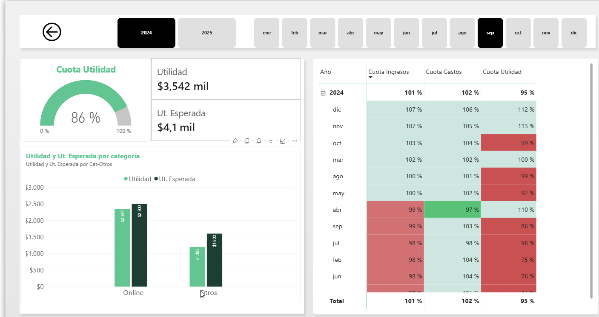

# 💰 Financial Performance Analytics Dashboard

Interactive financial performance dashboard developed with **Microsoft Power BI** to monitor and analyze income, expenses, profit, and balance against predefined financial targets and budgets.










## 🔗 Live Dashboard

👉 [View Interactive Dashboard in Power BI](https://app.powerbi.com/view?r=eyJrIjoiODBiZjFjZWMtNmViYy00MjM3LWI4MTYtYTYwYjJhNGZiYzE3IiwidCI6ImU1MTU4NTE4LTE1MGItNDMzZS05NjlhLTg0MTg5ODU0MjIyMyJ9)

## 📌 Project Overview

The goal of this project is to transform financial data into an interactive and easy-to-understand **Power BI dashboard**.

The report analyzes four key financial areas: **income, expenses, profit, and balance**, comparing actual results against expected values, targets, and budgets.

Users can explore financial performance by **year, month, and category**, allowing both high-level monitoring and detailed analysis of the factors affecting financial results.

This project was created as part of my continued learning and practice in **Data Analysis and Business Intelligence**.

## 📊 Dashboard Features

- 💵 Income analysis against established targets

- 💳 Expense analysis against budget

- 📈 Profit analysis against expected profit

- 💰 Balance analysis against expected balance

- 🎯 KPI achievement percentages for each financial area

- 📅 Interactive filtering by year and month

- 📊 Monthly financial performance analysis

- 🗂️ Income, expense, and profit analysis by category

- 📉 Actual vs expected performance comparisons

- 🎨 Conditional formatting to highlight deviations from targets

- 🔎 Detailed financial performance analysis

- 📋 Consolidated monthly financial comparison

## 📑 Report Pages

### 📊 Financial Overview

Provides a high-level overview of the main financial KPIs:

- Income vs Target

- Expenses vs Budget

- Profit vs Expected Profit

- Balance vs Expected Balance

KPI gauges allow financial performance to be evaluated quickly against established objectives.

### 💵 Income Analysis

Provides a detailed analysis of **income performance**.

The report compares actual income against established targets and allows performance to be analyzed by **month and category**.

### 💳 Expense Analysis

Analyzes **expenses against the allocated budget**, helping identify months and categories where spending exceeds or remains below expectations.

Conditional formatting makes budget deviations easier to identify.

### 📈 Profit Analysis

Analyzes actual **profit against expected profit**, including monthly evolution and performance across different categories.

### 💰 Balance Analysis

Tracks the evolution of the accumulated balance and compares it against the expected financial position.

Monthly trends make it possible to identify periods where the balance moves above or below expectations.

### 📋 Financial Comparison

Provides a consolidated monthly view of the main financial metrics:

- Income

- Income Target

- Income Achievement

- Expenses

- Budget

- Expense Achievement

- Profit

- Expected Profit

- Profit Achievement

- Balance

- Expected Balance

- Balance Achievement

## 📐 Key Performance Indicators

The dashboard uses several performance ratios to evaluate actual results against financial objectives.

### Income Achievement

`Income / Income Target`

### Expense Achievement

`Expenses / Budget`

### Profit Achievement

`Profit / Expected Profit`

### Balance Achievement

`Balance / Expected Balance`

These indicators provide a standardized way to compare financial performance across different periods and categories.

## 🛠️ Technologies

- Microsoft Power BI

- Power Query

- DAX

- Data Modeling

- Data Visualization

- KPI Analysis

- Conditional Formatting

- Interactive Filtering

## 📂 Project Structure

```text

03_Financial_Performance_Analytics/

│

├── Financial_Performance_Analytics.pbix

├── README.md

│

├── data/

│   └── financial_data.xlsx

│

└── images/

    └── dashboard.png